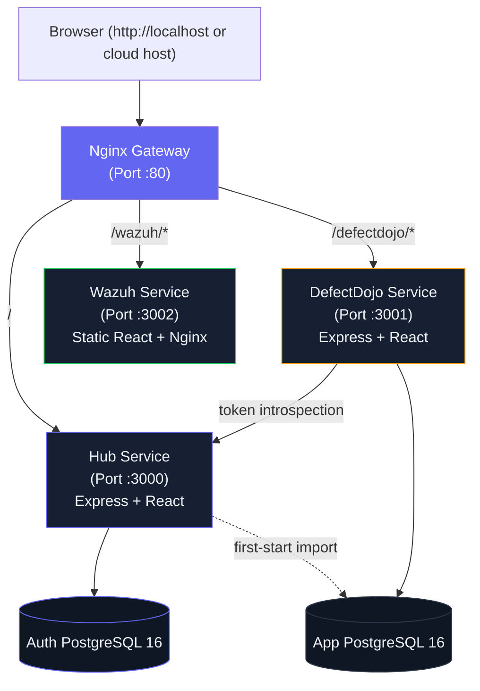

# Internal Security Middleware Hub

A high-performance, containerized microservices suite that serves as a centralized single sign-on (SSO) gateway and dashboard switcher for internal security tools, including **DefectDojo Viewer** and a mockup of the **Wazuh Viewer**.

---

## System Architecture

The suite consists of six containers orchestrated via Docker Compose:



### 1. Nginx Gateway (`gateway` · Port `80`)
The main gateway of the system. It handles:
- **Routing**: Proxy-passes requests from the browser to the backend services based on subpaths (`/` for Hub, `/defectdojo/` for DefectDojo, `/wazuh/` for Wazuh).
- **DNS Resolution**: Dynamically re-resolves container hostnames at runtime using Docker's internal DNS resolver (`127.0.0.11`) to prevent broken gateways when containers restart or receive new IPs.
- **SSE Buffering**: Disables proxy buffering for Server-Sent Events (SSE) stream endpoints (`/defectdojo/api/sync/events`) to enable real-time synchronization.
- **Security Headers**: Injects headers (`X-Frame-Options`, `X-Content-Type-Options`, `X-XSS-Protection`, `Referrer-Policy`) and enforces rate limiting (5r/s) on `/api/login` to prevent brute force attacks.

### 2. SSO Hub Service (`hub` · Port `3000`)
The entry point switcher portal:
- **Backend (Express)**: Owns authentication, initializes the `auth_*` schema in the separate auth database, manages sessions, and issues HMAC-SHA256 JWT access tokens valid for 1 hour.
- **Frontend (React)**: Split-screen brand layout login page, landing portal switcher card grid, and central user-management screen. Dynamically checks client-side health by querying endpoints (`/defectdojo/api/health` and `/wazuh/`) and displaying status badges (Healthy/Offline).

### 3. DefectDojo Viewer (`defectdojo` · Port `3001`)
Vulnerability workflow management tool:
- **Backend (Express)**: Validates Hub-issued JWTs, optionally introspects active sessions with the Hub, and connects only to the app database for findings/configuration/sync state.
- **Frontend (React)**: Displays pulled vulnerability findings, CVE compactions, and coordinates ticket workflows with Redmine. A "Back to Hub" nav item is integrated to return to the portal switcher.

### 4. Wazuh Viewer (`wazuh` · Port `3002`)
A frontend-only static mockup representing the SIEM & incident management dashboard:
- **Frontend (React)**: Interactive dashboard, filterable alerts feed, incident creation form, OS agent grid, and investigation timelines built from realistic mockup datasets.
- **Runtime (Nginx)**: Serves static compiled React assets. Validates auth token presence in `localStorage` on the frontend before loading.

### 5. Auth Database (`auth-db` · Port `5432` internally)
A PostgreSQL 16 database used only by the Hub for users, credentials, app memberships, sessions, and audit events.

### 6. App Database (`db` · Port `5432` internally)
A PostgreSQL 16 database used by DefectDojo Viewer for configuration, findings, Redmine sync state, sync history, mitigation reviews, and mapped product/engagement data. On first start, Hub can import legacy users from this database through `LEGACY_DATABASE_URL`, then identity is managed from `auth-db`.

---

## Single Sign-On (SSO) Mechanism

Because all containers are served behind the Nginx Gateway on port 80 under the same domain host (`http://localhost` locally, or `http://<server-ip-or-domain>` on a cloud server), they share a **single origin**. 

1. When the user logs in at the gateway root URL, the Hub backend checks `auth-db`, creates an active session, and issues a JWT token.
2. The Hub frontend saves this token in `localStorage` under `middleware_token` and the user profile under `middleware_user`.
3. When the user clicks on **DefectDojo Viewer** (`/defectdojo/`) or **Wazuh Viewer** (`/wazuh/`), the browser retains the shared `localStorage` state.
4. Each service extracts `middleware_token` from `localStorage` and appends it to requests as `Authorization: Bearer <token>`.
5. DefectDojo validates issuer/audience/app claims and, in Docker, calls Hub introspection so logout, suspension, and role changes take effect before token expiry.

---

## Getting Started

### Prerequisites
- Docker and Docker Compose installed.

### Setup and Start

1. **Configure Environment Variables**:
   Copy `.env.example` to `.env` and configure your settings:
   ```powershell
   Copy-Item .env.example .env
   ```

2. **Boot the Orchestration Stack**:
   Start all containers in detached mode:
   ```powershell
   docker compose up -d --build
   ```

3. **Access the Application**:
   Open **`http://localhost:8080`** in your browser.
   - **Default Credentials**: 
     - **Username**: `admin`
     - **Password**: `admin`

### Cloud Server Access

On a cloud VM, access the app through the gateway port only:

```powershell
http://<server-public-ip>:8080/
http://<server-public-ip>:8080/defectdojo/
http://<server-public-ip>:8080/wazuh/
```

The `hub`, `defectdojo`, `wazuh`, and database ports are intentionally internal Docker ports. If containers are healthy but the browser says the site cannot be reached, verify the host is publishing the gateway and the cloud firewall allows inbound TCP traffic on the chosen gateway port:

```powershell
docker compose ps
curl -I http://127.0.0.1/
```

`docker compose ps` should show `gateway` with `0.0.0.0:${GATEWAY_PORT:-8080}->80/tcp`. Open inbound TCP `8080`, then browse to `http://<server-public-ip>:8080/`.

---

## How to Use & Operations

### Independent Service Control
You can start, stop, or rebuild individual containers without affecting others. The Nginx gateway dynamically handles backend failover:

```powershell
# Stop a single service to test offline states
docker compose stop defectdojo

# Hub switcher dashboard will dynamically update the card status badge to "Offline"
# Restart the service to bring it back online
docker compose start defectdojo

# Rebuild a single service after making changes (e.g. Wazuh frontend)
docker compose up -d --build wazuh
```

### User Management
User administration is centralized:
- Log in as the `admin` user.
- Click **User Management** in the administration section of the Hub.
- The Hub API writes to `auth-db`. DefectDojo Viewer reads the current user identity from Hub-issued tokens and Hub introspection rather than storing password hashes locally.

### Database Credentials Note
> [!WARNING]
> Database volumes persist in Docker. If you update the app DB credentials (`PG_USER`, `PG_PASSWORD`, or `PG_DB`) or auth DB credentials (`AUTH_PG_USER`, `AUTH_PG_PASSWORD`, or `AUTH_PG_DB`) in `.env`, you must delete the relevant old database volume (`docker compose down -v`) for PostgreSQL to apply new credentials on initialization, otherwise you will encounter `FATAL: password authentication failed` errors.

---

## Directory Layout

- `/gateway` — Nginx gateway configuration file.
- `/hub` — Express + React code for the authentication and portal switcher app.
- `/defectdojo` — Express + React code for vulnerability management.
- `/wazuh` — Static React code for the SIEM mockup.
