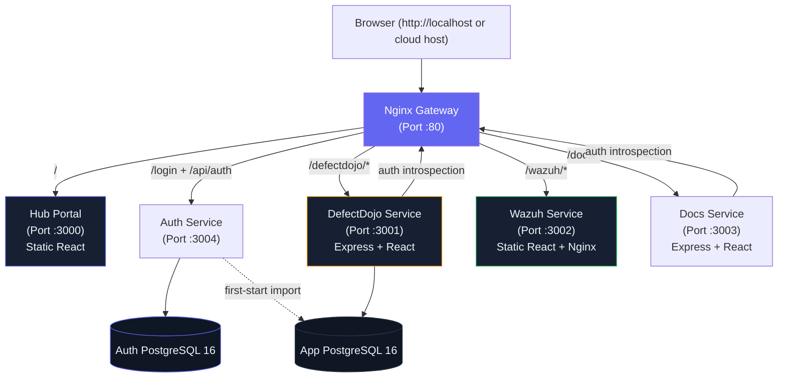

# Internal Security Middleware Hub

A high-performance, containerized microservices suite that serves as a centralized single sign-on (SSO) gateway and dashboard switcher for internal security tools, including **DefectDojo Viewer** and a mockup of the **Wazuh Viewer**.

---

## System Architecture

The suite consists of independently deployable portal, authentication, application, gateway, and database containers orchestrated via Docker Compose:



### 1. Nginx Gateway (`gateway` · Port `80`)
The main gateway of the system. It handles:
- **Routing**: Proxy-passes requests from the browser to the backend services based on subpaths (`/` for Hub, `/defectdojo/` for DefectDojo, `/wazuh/` for Wazuh).
- **DNS Resolution**: Dynamically re-resolves container hostnames at runtime using Docker's internal DNS resolver (`127.0.0.11`) to prevent broken gateways when containers restart or receive new IPs.
- **SSE Buffering**: Disables proxy buffering for Server-Sent Events (SSE) stream endpoints (`/defectdojo/api/sync/events`) to enable real-time synchronization.
- **Security Headers**: Injects headers (`X-Frame-Options`, `X-Content-Type-Options`, `X-XSS-Protection`, `Referrer-Policy`) and enforces rate limiting (5r/s) on `/api/login` to prevent brute force attacks.

### 2. Authentication Service (`auth-primary` · Port `3004`)
- A single Express auth service uses `auth-db`, manages sessions/users, and issues one-hour HMAC-SHA256 JWTs.
- The independent `/login/` React app and existing auth APIs stay available when the Hub portal is down.
- Startup schema/seed work is serialized with a PostgreSQL advisory lock.

### 3. Hub Portal (`hub` · Port `3000`)
- Static React workspace switcher and user-management frontend. It contains no authentication backend or database dependency.
- If unavailable, the Gateway displays a degraded service directory with direct links.

### 3. DefectDojo Viewer (`defectdojo` · Port `3001`)
Vulnerability workflow management tool:
- **Backend (Express)**: Validates auth-service JWTs locally, uses live introspection when available, and falls back to valid unexpired claims only during an auth transport outage.
- **Frontend (React)**: Displays pulled vulnerability findings, CVE compactions, and coordinates ticket workflows with Redmine. A "Back to Hub" nav item is integrated to return to the portal switcher.

### 4. Wazuh Viewer (`wazuh` · Port `3002`)
A frontend-only static mockup representing the SIEM & incident management dashboard:
- **Frontend (React)**: Interactive dashboard, filterable alerts feed, incident creation form, OS agent grid, and investigation timelines built from realistic mockup datasets.
- **Runtime (Nginx)**: Serves static compiled React assets. Validates JWT claims and expiry in the frontend before loading mock data.

### 5. Auth Database (`auth-db` · Port `5432` internally)
A PostgreSQL 16 database used by the auth service for users, credentials, app memberships, sessions, and audit events.

### 6. App Database (`db` · Port `5432` internally)
A PostgreSQL 16 database used by DefectDojo Viewer for configuration, findings, Redmine sync state, sync history, mitigation reviews, and mapped product/engagement data. On first start, Hub can import legacy users from this database through `LEGACY_DATABASE_URL`, then identity is managed from `auth-db`.

---

## Single Sign-On (SSO) Mechanism

Because all containers are served behind the Nginx Gateway on port 80 under the same domain host (`http://localhost` locally, or `http://<server-ip-or-domain>` on a cloud server), they share a **single origin**. 

1. The browser signs in at `/login/`; the auth service checks `auth-db`, creates a session, and issues a JWT.
2. The login frontend saves the token in `localStorage` under `middleware_token` and the profile under `middleware_user`, then returns to the requested service.
3. When the user clicks on **DefectDojo Viewer** (`/defectdojo/`) or **Wazuh Viewer** (`/wazuh/`), the browser retains the shared `localStorage` state.
4. Each service extracts `middleware_token` from `localStorage` and appends it to requests as `Authorization: Bearer <token>`.
5. DefectDojo and Docs validate signature/issuer/audience/app claims locally and normally introspect through the auth service. If auth is unreachable, locally valid tokens continue until expiry; revocation, suspension, and role changes can therefore be delayed by at most one hour.

---

## Getting Started

### Prerequisites
- Docker and Docker Compose installed.

### Setup and Start

1. **Configure Environment Variables**:
   Copy `.env.example` to `.env` and configure your settings:
   ```powershell
   Copy-Item .env.example .env
   ```

2. **Boot the Orchestration Stack**:
   Start the portable core stack in detached mode:
   ```powershell
   docker compose up -d --build
   ```

   On the Linux production host, enable the host-log collectors explicitly:
   ```powershell
   docker compose --profile host-logs up -d --build
   ```

   The `host-logs` profile is intentionally disabled during normal Windows
   development because its collectors require Linux host logs and the Docker
   socket.

3. **Access the Application**:
   Open **`http://localhost`** in your browser. If `GATEWAY_PORT` is changed,
   include that port explicitly.
   - **Default Credentials**: 
     - **Username**: `admin`
     - **Password**: `admin`

### Cloud Server Access

On a cloud VM, access the app through the gateway port only:

```powershell
http://<server-public-ip>/
http://<server-public-ip>/defectdojo/
http://<server-public-ip>/wazuh/
```

The `hub`, `defectdojo`, `wazuh`, and database ports are intentionally internal Docker ports. If containers are healthy but the browser says the site cannot be reached, verify the host is publishing the gateway and the cloud firewall allows inbound TCP traffic on the chosen gateway port:

```powershell
docker compose ps
curl -I http://127.0.0.1/
```

`docker compose ps` should show `gateway` with
`0.0.0.0:${GATEWAY_PORT:-80}->80/tcp`. Open inbound TCP `80` (or the configured
gateway port), then browse to `http://<server-public-ip>/`.

---

## Documentation

For a comprehensive, step-by-step walkthrough of all features, settings, user permissions, and sync operations, refer to the [Step-by-Step User Guide](docs-service/docs/user-guide.md).

---

## How to Use & Operations

### Independent Service Control
You can start, stop, or rebuild individual containers without affecting others. The Nginx gateway dynamically handles backend failover:

```powershell
# Stop a single service to test offline states
docker compose stop defectdojo

# Hub switcher dashboard will dynamically update the card status badge to "Offline"
# Restart the service to bring it back online
docker compose start defectdojo

# Rebuild a single service after making changes (e.g. Wazuh frontend)
docker compose up -d --build wazuh
```

### Authentication and Hub outage checks

```powershell
# Hub outage: login and direct services remain available; / shows a degraded directory.
docker compose stop hub

# With auth stopped, existing unexpired tokens use local validation.
docker compose stop auth
```

### Concurrent login and service capacity test

The zero-dependency runner separates login throttling from actual DefectDojo capacity and stops each scenario at its first unhealthy stage:

```powershell
# Small verification run
$env:LOAD_LEVELS="1,2"
$env:LOAD_REQUESTS_PER_WORKER="2"
node scripts/concurrency-load-test.cjs --scenario=all

# Ramped capacity search with container CPU/memory snapshots
$env:LOAD_LEVELS="1,5,10,25,50,100"
$env:LOAD_REQUESTS_PER_WORKER="10"
$env:LOAD_DOCKER_STATS="true"
node scripts/concurrency-load-test.cjs --scenario=all
```

Scenarios are `login`, `service` (one shared session), `end-to-end` (login → repeated service use → logout), or `all`. Configure credentials with `LOAD_USERNAME` and `LOAD_PASSWORD`, or set `LOAD_USERS_FILE` to a JSON array of `{ "username", "password" }` objects. Results include RPS, error rate, p50/p95/p99 latency, health attribution, the last healthy concurrency, and the first degraded concurrency under `load-results/`.

The Gateway deliberately limits login to 5 requests/second plus a burst of 10 and reports that boundary as `429 rate-limited`; this is not a server outage. The runner refuses non-local targets unless `LOAD_ALLOW_REMOTE=true` is explicitly set.

### Lightweight project monitoring

The Compose stack includes a Glances monitor container for whole-project resource visibility across the host and all Docker services:

```powershell
docker compose up -d monitor
```

The monitor is isolated behind the `monitoring` profile. Starting it explicitly
activates that profile; it is not part of the normal core startup.

The dashboard is bound to localhost only at `127.0.0.1:${MONITOR_PORT:-61208}`. On a remote Linux server, access it with an SSH tunnel:

```powershell
ssh -L 61208:127.0.0.1:61208 user@<server-public-ip>
```

Then open `http://localhost:61208`. Watch `defectdojo`, `db`, and `auth-db` during large Sync Findings runs.

### User Management
User administration is centralized:
- Log in as the `admin` user.
- Click **User Management** in the administration section of the Hub.
- The auth-service API writes to `auth-db`. DefectDojo reads auth-service tokens and live introspection rather than storing password hashes locally.

### Database Credentials Note
> [!WARNING]
> Database volumes persist in Docker. If you update the app DB credentials (`PG_USER`, `PG_PASSWORD`, or `PG_DB`) or auth DB credentials (`AUTH_PG_USER`, `AUTH_PG_PASSWORD`, or `AUTH_PG_DB`) in `.env`, you must delete the relevant old database volume (`docker compose down -v`) for PostgreSQL to apply new credentials on initialization, otherwise you will encounter `FATAL: password authentication failed` errors.

---

## Directory Layout

- `/gateway-service` — Nginx gateway, auth routing, and degraded Hub page.
- `/auth-service` — Express authentication API and standalone login app.
- `/hub-service` — Static React portal switcher and user-management frontend.
- `/vulnerability-service` — Express + React code for vulnerability management.
- `/wazuh-service` — Static React code for the SIEM mockup.
- `/docs-service` — React + Express documentation reader and Markdown content.

The stable Compose names, source directories, and public routes are listed in
the [service catalog](docs/architecture/service-catalog.md).
