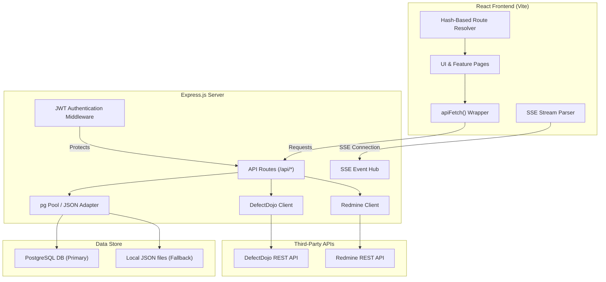
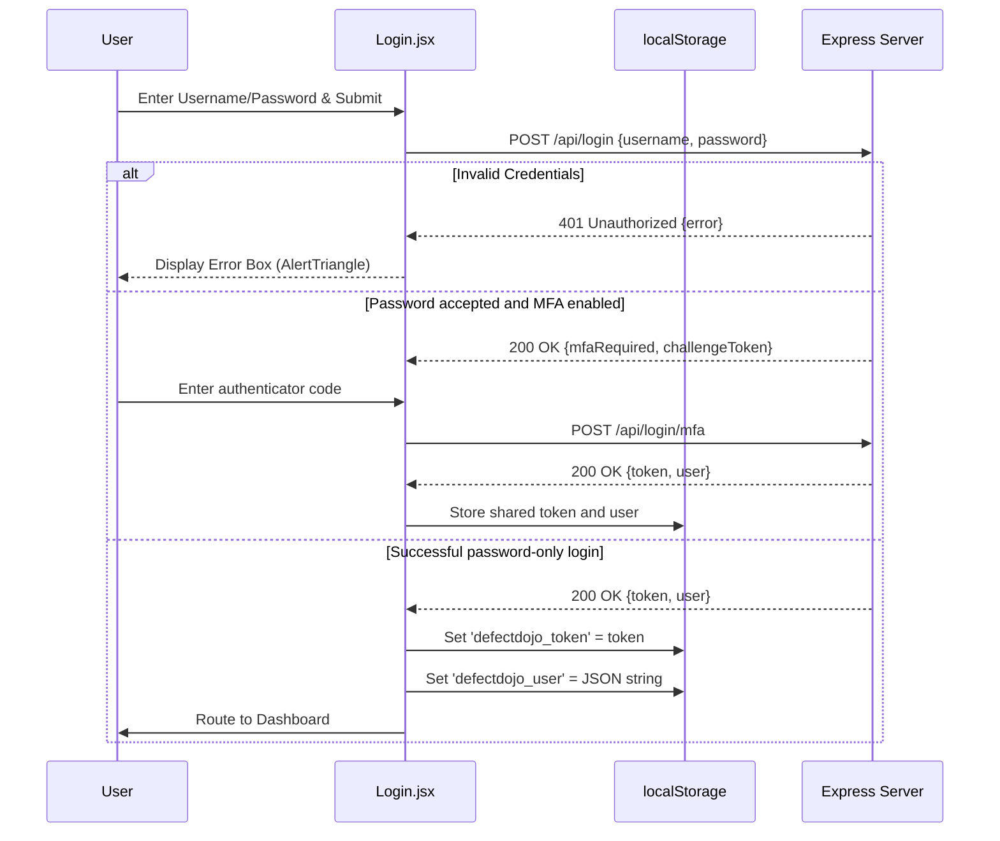
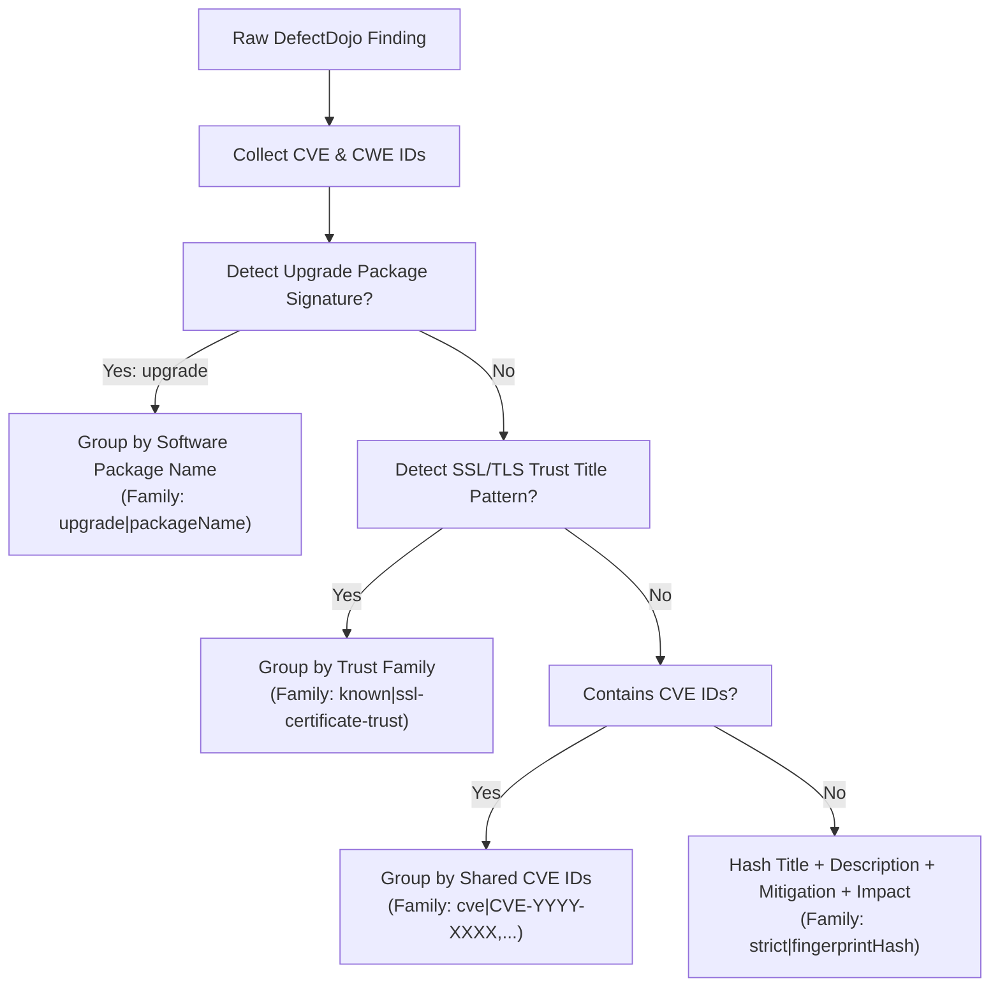
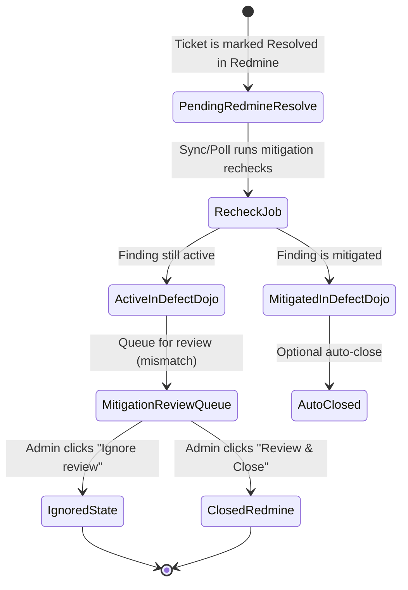

# DefectDojo Viewer — Frontend Feature & Architecture Specification

This comprehensive documentation details every feature, routing path, state flow, API contract, and visual element within the **DefectDojo Viewer** application. It is designed to serve as a complete technical guide for frontend developers building new UX/UI layouts or refactoring the interface.

---

## Table of Contents
1. [Architecture & Technology Stack](#1-architecture--technology-stack)
2. [Route Resolution & Permissions](#2-route-resolution--permissions)
3. [Authentication & Auth Flow](#3-authentication--auth-flow)
4. [App Shell & Navigation Sidebar](#4-app-shell--navigation-sidebar)
5. [Dashboard & Metrics Panels](#5-dashboard--metrics-panels)
6. [Compacted Findings & Compaction Logic](#6-compacted-findings--compaction-logic)
7. [Findings Explorer, Filters, & Actions](#7-findings-explorer-filters--actions)
8. [Products & Engagements Directory](#8-products--engagements-directory)
9. [Data Sync & Pull Orchestration](#9-data-sync--pull-orchestration)
10. [Mitigation Review Workflow](#10-mitigation-review-workflow)
11. [Sync History Audit Log](#11-sync-history-audit-log)
12. [Configuration Settings & Admin Controls](#12-configuration-settings--admin-controls)
13. [User Directory & Administration](#13-user-directory--administration)
14. [Notification Management](#14-notification-management)
15. [Domain Data Models & Database Schemas](#15-domain-data-models--database-schemas)
16. [Complete API Endpoint Reference](#16-complete-api-endpoint-reference)
17. [Design Tokens & Styling System](#17-design-tokens--styling-system)

---

## 1. Architecture & Technology Stack

The application employs a React frontend built with Vite and an Express.js backend using the CommonJS module standard. Real-time notifications and progress updates are delivered asynchronously to the frontend via **Server-Sent Events (SSE)**.



### Stack Summary
- **Frontend Core**: React, plain CSS stylesheets, and the `lucide-react` library for consistent iconography.
- **Routing**: Client-side hash-based routing (`window.location.hash`), avoiding the overhead of heavy routing libraries.
- **State Management**: Context-free local component states synced with backend endpoints and the SSE stream.
- **Real-Time Data**: Persistent Server-Sent Events (SSE) stream (`/api/sync/events`) updating UI indicators instantly.
- **Database Fallback**: Runs on PostgreSQL when `DATABASE_URL` is configured, fallback to JSON files (`config.json`, `users.json`, etc.) if database configuration is missing.

---

## 2. Route Resolution & Permissions

Routing in DefectDojo Viewer relies on the URL hash. Deep linking is fully supported, allowing filters and search parameters to be preserved in the hash query parameters.

### Route Definitions (`src/app/routes.js`)

| Route ID | Hash Prefix | Requires Admin | Page Description |
|---|---|---|---|
| `dashboard` | `#dashboard` or empty | No | SOC-style landing page with metric summaries and embedded findings |
| `findings` | `#findings` | No | Full list of compacted vulnerability findings |
| `products` | `#products` | No | Grid of products containing lists of engagements |
| `productDashboard` | `#product-dashboard` | No | Per-product dashboard screen with stats |
| `productFindings` | `#product-findings` | No | Compacted findings filtered to a specific product |
| `syncHistory` | `#sync-history` | Yes | Audit log of data sync operations |
| `mitigationReview` | `#mitigation-review` | Yes | Mitigation review queue and action history |
| `notifyManagement` | `#notify-management` | Yes | IP/host mapping configuration for notification endpoints |
| `users` | `#users` | Yes | Legacy route that redirects to Hub user administration |
| `settings` | `#settings` | Yes | Global settings (DefectDojo/Redmine configurations, database controls) |

### Deep Linking Schema
The query resolver splits parameters in the hash string, allowing variables to be parsed and injected into component states on mount:
```text
#product-findings?productId=4&engagementId=12&redmineStatus=resolve&severity=Critical&q=openssl
```

### Authorization Rules
- The application router maps route flags on page render.
- If a user with the `viewer` role navigates to an admin-only hash route (e.g., `#settings`), the router intercepts the action and redirects them to the default `#dashboard`.

---

## 3. Authentication & Auth Flow

The authentication system verifies user credentials via the backend and stores session details in local storage.



### Session Persistence & Validation
- On initialization, `App.jsx` reads `localStorage` for `defectdojo_token` and `defectdojo_user`.
- To confirm validity, the app attempts to perform its initial dashboard query using the saved token.
- If any API request responds with `401 Unauthorized`, the client intercepts the status code, triggers the logout callback, clears credentials from `localStorage`, dispatches `AUTH_EXPIRED_EVENT`, and resets the URL hash.

### API Authorization Headers
The apiFetch wrapper (`src/shared/api/api.js`) automatically appends authorization details:
```javascript
headers['Authorization'] = `Bearer ${token}`;
```

---

## 4. App Shell & Navigation Sidebar

The main application layout wraps page views in `AppShell.jsx`, featuring a responsive left-side navigation sidebar.

### Sidebar Interface Components
1. **Brand Header**: Renders the application logo with the `AlertTriangle` icon, display text, and product version.
2. **User Profile Card**: Displays the logged-in username alongside a role badge (`Admin` or `Viewer`).
3. **Primary Navigation Links**:
   - `Dashboard` (Available to all users)
   - `Sync History` (Admin only)
   - `Notify Management` (Admin only)
   - `Mitigation Review` (Admin only) — Contains a pending counter badge (`mitigationReviewPendingCount`). Renders with an animated warning class if count > 0.
   - `Users` (Admin only)
   - `Settings` (Admin only)
4. **Footer Actions**:
   - **Theme Selector**: A slider component (`ThemeToggle.jsx`) that toggles the visual theme.
   - **Refresh Action**: Trigger button with `RefreshCw` icon. Rotates during fetching and is disabled during dashboard reload.
   - **Sign Out Action**: Danger-styled exit button with `LogOut` icon. Clears session store.

---

## 5. Dashboard & Metrics Panels

The Security Dashboard (`DashboardPage.jsx`) gives security operators a high-level visual breakdown of vulnerability risk.

### Hero Header Status Indicators
- **User Indicator**: Shows current session username and role badge.
- **Database Connectivity Status**: A status indicator (`Connected` vs `Reconnecting` badge). Updated dynamically through the SSE stream heartbeat.
- **Redmine Polling Status**: Renders status indicators (`enabled`, `running`, `disabled`, or `error`). Includes an animated spin state when the background Redmine poll is processing.
- **Sync All Action Button** (Admin only): Displays `Sync All (X)` where `X` is the current compacted findings count. Triggers the sync filters modal.

### Metrics Grid Layout (`DashboardOverviewCards.jsx`)
The page renders three summary panels to aggregate vulnerabilities:

```
+------------------------------------+------------------------------------+------------------------------------+
|        Vulnerability Status        |          Ticket Workflow           |     Severity & Risk Distribution   |
|                                    |                                    |                                    |
| [Active Count]  -->  [Mitigated]   | [New] [In-Progress] [Feedback]     | [Critical] [High] [Medium]         |
|  Unresolved           Resolved     | [Resolved] [Closed]                | [Low] [Info]                       |
+------------------------------------+------------------------------------+------------------------------------+
```

1. **Vulnerability Status Card**: Computes the volume of active findings versus mitigated findings, rendering a flow path (arrow) showing resolution progress.
2. **Ticket Workflow Card**: Displays a five-column grid representing Redmine tickets mapped by status: *New, In Progress, Feedback, Resolved, Closed*.
3. **Severity & Risk Distribution Card**: Displays a color-coded grid representing the volume of findings classified by severity: *Critical (Red), High (Orange), Medium (Yellow), Low (Green), Info (Blue)*.

---

## 6. Compacted Findings & Compaction Logic

Vulnerabilities generated by automated scans are highly repetitive. The compaction engine groups raw DefectDojo findings into logical, ticket-sized rows.



### Compaction Families (`src/domain/findings/vulnerabilityUtils.js`)
- **Upgrade Family**: Findings suggesting software updates (e.g., "Upgrade openssl to version 1.1.1t") are grouped by package name. Key format: `upgrade|<softwareName>`.
- **SSL Certificate Trust Family**: Certificate trust warnings lacking specific CVEs are grouped under a unified certificate family. Key format: `known|ssl-certificate-trust`.
- **Shared CVE Family**: Findings containing identical CVEs are grouped together. Key format: `cve|<cveList>`.
- **Strict Fingerprint Family**: When no CVE or upgrade text is found, findings are grouped by matching hashes of their normalized *Title + Description + Mitigation + Impact* texts. Key format: `strict|<hash>`.

### Sync Keys (Redmine Ticket Mapping)
The application links finding groups to Redmine issues using a deterministic, stable key:

1. **Modern Sync Keys** (`buildCompactedSyncKey`):
   Generates a hash based on the `groupKey`, `productIds`, and `engagementIds`:
   $$\text{SyncKey} = \text{"dd-compact-" } + \text{stableHash}(\text{"group:"} + \text{groupKey} + \text{ "|products:"} + \text{productIds} + \text{ "|engagements:"} + \text{engagementIds})$$
   *Note: Finding-ID independent, preventing broken ticket links when finding IDs regenerate.*

2. **Legacy Sync Keys** (`buildLegacyCompactedSyncKey`):
   Includes raw finding IDs in the hash input:
   $$\text{SyncKey} = \text{"dd-compact-" } + \text{stableHash}(\text{"group:"} + \text{groupKey} + \text{ "|findings:"} + \text{findingIds} + \text{ "|products:"} + \dots)$$
   *Note: Maintained for backwards compatibility with existing tickets.*

---

## 7. Findings Explorer, Filters, & Actions

The findings explorer (`FindingsPage.jsx`) displays compacted finding cards with deep filtering controls.

### Filtering Pipeline
Filters apply sequentially on the front-end to optimize render times:
1. **Scope Tree Filter**: Limits results to specific products, engagements, or branches.
2. **Redmine Status Filter**: Filters by Redmine ticket states (e.g., Unlinked, New, Resolved).
3. **Severity Filter**: Renders dynamic severity count blocks. Selection narrows visible findings.
4. **Text Search Bar**: Evaluates input strings against *Title, CVEs, CWEs, description text, endpoints, and Redmine IDs*. Supports Ctrl+K to focus search.

### Card Details & Expanded view
Clicking a compacted finding card expands a drawer detailing:
- **Mitigation & Impact**: Instructions, code adjustments, and impact metrics.
- **Affected Assets**: Accordion list containing endpoints, host addresses, ports, and associated CVE mappings.
- **Source Group Breakdowns**: Shows the raw sub-findings inside the compaction grouping.
- **DefectDojo Links**: Deep links to the original DefectDojo finding instances.
- **Redmine Actions Box**:
  - **Check Redmine**: Checks ticket status.
  - **Create Redmine Ticket**: Generates a Redmine ticket, formatting details into markdown blocks.
  - **Link Existing**: Map an existing Redmine ticket ID manually to the compaction group.

### Share & Export Features
- **Share View Button**: Copies a shareable URL containing the active page state.
- **CSV Export**: Compiles visible findings into a static CSV spreadsheet containing *Title, Severity, Product/Engagement, Redmine ID, status, CVE lists, and dates*.

---

## 8. Products & Engagements Directory

The Products view organizes scan listings, making it easy to drill down into specific areas.

### Directory Grid (`ProductsPage.jsx`)
- Displays cards for all synced products.
- Shows total compacted findings, raw finding totals, and engagement counts.
- **Staggered Entry Animations**: Product cards slide in sequentially.
- Clicking a card navigates to the **Product Dashboard** (`#product-dashboard?productId=X`).
- Clicking an engagement sub-row redirects directly to the **Product Findings** list (`#product-findings?productId=X&engagementId=Y`).

### Product Dashboard (`ProductDashboardPage.jsx`)
- Provides a detailed dashboard scoped to a single product.
- Displays product-level severity counts and a visual breakdown of active engagements.
- Action buttons allow users to return to the product listing or view all product findings.

---

## 9. Data Sync & Pull Orchestration

Data synchronization moves findings from DefectDojo to the local database, compacts them, and syncs their status with Redmine.

```
                  [ FRONTEND ACTION: "Sync All" ]
                                 |
                                 v
                     [ 1. DefectDojo Pull Route ]
                     - Query DD API (filters, dates)
                     - Map findings, products, engagements
                     - Save to Local Database
                                 |
                                 v
                     [ 2. Compaction Engine ]
                     - Group raw findings into CVE/Package keys
                     - Generate deterministic Sync Keys
                                 |
                                 v
                     [ 3. Redmine Ticket Sync ]
                     - Lookup tickets in Redmine via Sync Key
                     - Update status in Local DB
                     - Update changed ticket priorities/descriptions
                     - Create missing tickets (if auto-create enabled)
                                 |
                                 v
                     [ 4. Mitigation Rechecks ]
                     - Identify tickets resolved in Redmine
                     - Verify if DefectDojo findings are mitigated
                     - Push mismatch issues to Mitigation Review
```

### Server-Sent Events (SSE) Stream
Sync All runs as an asynchronous background task. Progress details stream in real-time to the frontend over a Server-Sent Events (SSE) connection:
- **Event Types**: `sync-all-progress` (delivers steps and percentages), `dashboard-sync` (updates counts), and `heartbeat`.
- **Frontend Sync Progress Overlay**: Shows a progress bar, step descriptions, and sync statistics (*pulled, compacted, created, updated, mitigationQueued*). It blocks the user interface until the sync finishes.

---

## 10. Mitigation Review Workflow

The Mitigation Review panel (`MitigationReview.jsx`) acts as a gatekeeper, letting admins confirm resolved tickets before closing them.



### Review Interface Layout
Admins can toggle between two tabs:
1. **Queue Tab**: Lists resolved tickets waiting for review. Rows show the Redmine issue ID, finding details, severity, product route, and mitigation confirmation time.
2. **History Tab**: Displays an audit log of past review actions, showing the action type, reviewer, timestamp, and notes.

### Review Actions & Modals
- **Review & Close**: Opens a dialog to add reviewer notes. Submitting closes the ticket in Redmine and archives the review item.
- **Ignore Review**: Archives the review item without closing the Redmine ticket.
- **Bulk Operations**: Admins can select multiple items to batch-close or batch-ignore them.

---

## 11. Sync History Audit Log

The Sync History page (`SyncHistory.jsx`) provides an audit trail of pull and sync operations.

### Key Features
- **Filter and Group View**: Filters sync history entries by date range, type (*Pull*, *Sync All*, *Background Poll*), and status (*success*, *warning*, *failed*).
- **Compare Tool**: Select two sync operations to view differences in findings pulled, tickets created, and mitigations processed.
- **Detail Panel**: Displays warning messages, error trace logs, and details of sync settings.

---

## 12. Configuration Settings & Admin Controls

The Settings panel (`Settings.jsx`) configures API connections and system settings.

### Settings Layout
- **DefectDojo Settings**: API URL, authentication keys, and default sync filters (severity, active, verified, mitigated).
- **Redmine Settings**: URL, API key, project identifiers, and trackers.
- **Ticket Mapping Rules**: Priority mappings (matching Redmine priorities to Critical, High, Medium, Low, Info severities) and status mappings.
- **Database Utilities**:
  - **Backup Configuration**: Saves system configurations to a backup file.
  - **Restore Database**: Restores system state from a backup file.
  - **Rebuild Redmine Status Cache**: Clears the local ticket status cache and queries Redmine to rebuild it.
  - **Clear Local Storage**: Deletes local database records and reset the system.

---

## 13. User Directory & Administration

User administration is centralized in the Hub's `UsersPage.jsx`. The Vulnerability application redirects legacy user-management links to the Hub rather than maintaining a second administration screen.

### Key Features
- **User Directory Grid**: Lists Hub identities, roles, account status, presence, and allowed product scopes.
- **Create/Edit User Dialog**: Sets passwords, roles (`admin` or `viewer`), and product restrictions.
- **Access Scope Constraints**:
  - Hub stores identities, credentials, sessions, and app memberships in the authentication database.
  - If a user is restricted to specific products, the Vulnerability frontend limits its findings and dashboard views to those products.
  - The Vulnerability backend also enforces these restrictions by filtering database queries.

---

## 14. Notification Management

The Notification screen (`NotifyManagement.jsx`) maps IP addresses and hostname signatures to custom notification targets, routing automated alerts to the correct development teams.

---

## 15. Domain Logic & Data Models & Database Schemas

### PostgreSQL Schema Mapping (`backend/data/database.cjs` & migrations)

#### Users (`defectdojo_viewer_users`)
Stores user accounts, passwords, and access restrictions.
```sql
CREATE TABLE defectdojo_viewer_users (
    username text PRIMARY KEY CHECK (length(trim(username)) > 0),
    salt text NOT NULL,
    password_hash text NOT NULL,
    role text NOT NULL CHECK (length(trim(role)) > 0),
    products jsonb NOT NULL DEFAULT '[]'::jsonb,
    created_at timestamptz NOT NULL DEFAULT now(),
    updated_at timestamptz NOT NULL DEFAULT now()
);
```

#### Global Configuration (`defectdojo_viewer_config`)
Stores API connections and priority settings.
```sql
CREATE TABLE defectdojo_viewer_config (
    key text PRIMARY KEY,
    value jsonb NOT NULL,
    updated_at timestamptz NOT NULL DEFAULT now()
);
```

#### Redmine Ticket Mappings (`defectdojo_viewer_redmine_tickets`)
Tracks links between compacted findings and Redmine issues.
```sql
CREATE TABLE defectdojo_viewer_redmine_tickets (
    ticket_key text PRIMARY KEY,
    sync_key text,
    issue_id text,
    product_key text,
    product_id text,
    product_name text,
    engagement_key text,
    engagement_id text,
    engagement_name text,
    cve_id text,
    finding_ids text[] NOT NULL DEFAULT ARRAY[]::text[],
    status_id text,
    status_name text,
    normalized_status text,
    is_closed boolean NOT NULL DEFAULT false,
    subject text,
    issue_url text,
    raw jsonb NOT NULL DEFAULT '{}'::jsonb,
    last_seen_sync_id bigint,
    created_at timestamptz NOT NULL DEFAULT now(),
    updated_at timestamptz NOT NULL DEFAULT now()
);
```

#### Sync History Logs (`defectdojo_viewer_sync_history`)
```sql
CREATE TABLE defectdojo_viewer_sync_history (
    id bigserial PRIMARY KEY,
    product_key text,
    product_id text,
    product_name text,
    engagement_key text,
    engagement_id text,
    engagement_name text,
    sync_type text NOT NULL,
    started_at timestamptz NOT NULL DEFAULT now(),
    finished_at timestamptz,
    status text NOT NULL DEFAULT 'partial',
    findings_pulled integer NOT NULL DEFAULT 0,
    tickets_pulled integer NOT NULL DEFAULT 0,
    findings_updated integer NOT NULL DEFAULT 0,
    tickets_updated integer NOT NULL DEFAULT 0,
    findings_mitigated integer NOT NULL DEFAULT 0,
    findings_still_active integer NOT NULL DEFAULT 0,
    warnings jsonb NOT NULL DEFAULT '[]'::jsonb,
    errors jsonb NOT NULL DEFAULT '[]'::jsonb,
    requested_filters jsonb NOT NULL DEFAULT '{}'::jsonb,
    triggered_by text NOT NULL DEFAULT '',
    triggered_role text NOT NULL DEFAULT '',
    severity_breakdown jsonb NOT NULL DEFAULT '{}'::jsonb,
    created_at timestamptz NOT NULL DEFAULT now()
);
```

#### Mitigation Review Queue (`defectdojo_viewer_mitigation_reviews`)
```sql
CREATE TABLE defectdojo_viewer_mitigation_reviews (
    review_key text PRIMARY KEY,
    sync_history_id bigint,
    ticket_key text,
    issue_id text,
    defectdojo_finding_id text,
    product_key text,
    product_id text,
    product_name text,
    engagement_key text,
    engagement_id text,
    engagement_name text,
    cve_id text,
    title text,
    endpoint text,
    severity text,
    redmine_status_id text,
    redmine_status_name text,
    mitigation_confirmed_at timestamptz,
    last_sync_history_id bigint,
    state text NOT NULL DEFAULT 'pending',
    ignored_reason text,
    raw jsonb NOT NULL DEFAULT '{}'::jsonb,
    created_at timestamptz NOT NULL DEFAULT now(),
    updated_at timestamptz NOT NULL DEFAULT now(),
    reviewed_by text,
    reviewed_at timestamptz
);
```

---

## 16. Complete API Endpoint Reference

All backend API requests require authorization, using JWT tokens sent in the HTTP headers. Endpoints marked **Admin** require the `role === 'admin'` claim.

| HTTP Method | API URL Path | Admin | Payload / Parameters | Response Shape |
|---|---|---|---|---|
| **POST** | `/api/login` | No | `{username, password}` | Session response or `{mfaRequired, challengeToken, authenticatorApp}` |
| **POST** | `/api/login/mfa` | No | `{challengeToken, code, mode: "totp"}` | Session or password-change challenge |
| **POST** | `/api/login/password-change` | No | `{challengeToken, newPassword}` | Session after temporary-password replacement |
| **POST** | `/api/logout` | No | None (Token Header) | `{message: "Logged out"}` |
| **GET** | `/api/profile` | No | None | Read-only identity and MFA status |
| **POST** | `/api/profile/mfa/enrollment/start` | No | `{provider, currentPassword}` | Pending-only setup token, QR URI, manual key |
| **POST** | `/api/profile/mfa/enrollment/confirm` | No | `{setupToken, code}` | Enabled MFA status |
| **GET** | `/api/users` | **Yes** | None | `Array<{username, role, products: []}>` |
| **POST** | `/api/users` | **Yes** | Identity, access, MFA mode, admin password | User plus one-time temporary password |
| **POST** | `/api/users/:username/password/reset` | **Yes** | Admin password and optional email flag | One-time temporary password |
| **PATCH/POST** | `/api/users/:username/mfa` | **Yes** | Admin password and mode/action | Pending/enabled/disabled MFA state |
| **GET/PATCH** | `/api/settings/email` | **Yes** | Runtime SMTP settings and admin password | Redacted saved settings |
| **DELETE** | `/api/users/:username` | **Yes** | None | `{message: "User deleted"}` |
| **GET** | `/api/config` | No | None | `{defectDojoUrl, redmineUrl, trackers, ...}` |
| **POST** | `/api/config` | **Yes** | Configuration Object | `{message: "Config saved successfully"}` |
| **GET** | `/api/config/backups` | **Yes** | None | `Array<{fileName, size, createdAt}>` |
| **POST** | `/api/config/backup` | **Yes** | `{label: "str"}` | Backup file metadata object |
| **GET** | `/api/config/backups/:fileName/export` | **Yes** | None | Raw backup JSON file stream |
| **GET** | `/api/config/export` | **Yes** | None | Current configuration JSON |
| **POST** | `/api/config/import` | **Yes** | Raw backup JSON | `{message: "Backup file imported successfully"}` |
| **POST** | `/api/config/restore` | **Yes** | `{fileName: "str"}` | `{message: "Database restore completed"}` |
| **GET** | `/api/dashboard/summary` | No | `productId?`, `engagementId?` | Severity distribution, ticket workflows, finding counts |
| **GET** | `/api/compacted-cves` | No | `productId?`, `engagementId?`, `redmineStatus?`, `severity?`, `q?` | `Array<CompactedFinding>` |
| **GET** | `/api/findings` | No | None | `Array<RawFinding>` |
| **POST** | `/api/pull` | **Yes** | `{pullFilters: {}}` | Sync transaction result |
| **POST** | `/api/clear` | **Yes** | None | `{message: "Database and settings wiped"}` |
| **GET** | `/api/redmine/sync/status` | No | None | Poller configurations, running states, error logs |
| **POST** | `/api/redmine/rebuild-status` | **Yes** | None | Rebuild task status result |
| **POST** | `/api/redmine/issues/status` | **Yes** | Compacted Finding group | Updated Redmine ticket object |
| **POST** | `/api/redmine/issues/check` | **Yes** | Compacted Finding group | `{exists: boolean, issue: object / null}` |
| **POST** | `/api/redmine/issues` | **Yes** | Compacted Finding group | Created Redmine ticket object |
| **GET** | `/api/mitigation-rechecks` | No | None | `Array<MitigationRecheckAuditLog>` |
| **GET** | `/api/admin/mitigation-queue` | **Yes** | None | `Array<MitigationReviewRow>` |
| **GET** | `/api/admin/mitigation-actions` | **Yes** | `limit?` | `Array<AdminActionHistoryRow>` |
| **POST** | `/api/admin/mitigation-queue/:reviewKey/actions` | **Yes** | `{action: "close_redmine" / "ignore", reason}` | `{message: "Action processed successfully"}` |
| **GET** | `/api/sync-history` | **Yes** | None | `Array<SyncHistoryLog>` |
| **GET** | `/api/sync-history/:id` | **Yes** | None | Detailed single Sync History Log object |
| **POST** | `/api/sync-all` | **Yes** | `{pullFilters: {}, autoCreateTickets: bool}` | Server-Sent Events stream initialization |
| **GET** | `/api/logs` | **Yes** | None | Recent system log lines text payload |
| **DELETE** | `/api/logs` | **Yes** | None | `{message: "Logs cleared"}` |
| **GET** | `/api/sync/events` | No | None | Real-time Server-Sent Events (SSE) stream |

---

## 17. Design Tokens & Styling System

The application styling runs on vanilla CSS, using custom tokens defined as CSS variables in `src/styles/theme.css` to support both dark and light modes.

### Core Color System Tokens

| Custom Token | Dark Theme Value (Default) | Light Theme Value | Purpose |
|---|---|---|---|
| `--primary` | `#818cf8` (Indigo 400) | `#6366f1` (Indigo 500) | High-emphasis interactive elements |
| `--primary-hover` | `#6366f1` | `#4f46e5` | Hover states |
| `--bg-body` | `#0f172a` (Slate 900) | `#f8fafc` (Slate 50) | Main background color |
| `--bg-card` | `#1e293b` (Slate 800) | `#ffffff` | Panel and card backgrounds |
| `--text-main` | `#f1f5f9` (Slate 100) | `#0f172a` (Slate 900) | Primary text |
| `--text-muted` | `#94a3b8` (Slate 400) | `#64748b` (Slate 500) | Secondary and helper text |
| `--border` | `#334155` (Slate 700) | `--border-strong` (Slate 200) | Standard layout borders |

### Severity Token Mappings

| Severity Level | Indicator Color (CSS Token) | Background Token (Transparency) | Text Token |
|---|---|---|---|
| **Critical** | `--critical` (`#ef4444` / `#dc2626`) | `--critical-bg` (14% / 8%) | `--critical-text` (`#fca5a5` / `#dc2626`) |
| **High** | `--high` (`#f97316` / `#ea580c`) | `--high-bg` (14% / 8%) | `--high-text` (`#fdba74` / `#ea580c`) |
| **Medium** | `--medium` (`#eab308` / `#ca8a04`) | `--medium-bg` (13% / 8%) | `--medium-text` (`#fde68a` / `#a16207`) |
| **Low** | `--low` (`#22c55e` / `#16a34a`) | `--low-bg` (12% / 8%) | `--low-text` (`#86efac` / `#16a34a`) |
| **Info** | `--info` (`#3b82f6` / `#2563eb`) | `--info-bg` (14% / 8%) | `--info-text` (`#93c5fd` / `#2563eb`) |

### Micro-Transitions
Global theme transitions apply to background colors and borders for smooth transitions between light and dark modes:
```css
html[data-theme] *,
html[data-theme] *::before,
html[data-theme] *::after {
  transition-property: background-color, border-color, color, box-shadow, opacity;
  transition-duration: 0.2s;
  transition-timing-function: ease;
}
```
*(Note: Elements using keyframe animations or status indicators like `.spin` are excluded from the global transition to keep animations smooth.)*
