# Vulnerability Service Feature Workflows

This document maps the user-visible and admin workflows in
`vulnerability-service`. The diagrams use Mermaid and are intended to render in
GitHub, supported Markdown previewers, and most architecture documentation
tools.

## Feature Coverage

- Runtime startup and shared storage
- Authentication, authorization, and legacy local user administration
- App shell routing and admin gating
- Dashboard, summary cards, and live sync events
- Findings search, filtering, detail view, and Redmine opening
- Product/company portal drilldown
- DefectDojo pull
- Sync Findings / Sync All
- Redmine status check, rebuild, and background polling
- Sync history
- Mitigation review queue and history
- Settings: connections, Redmine status, mapped assets, backups, and debug tools
- Log monitor

## System Feature Map

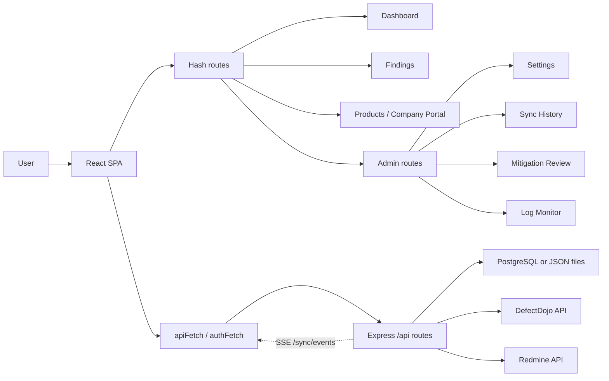

## Runtime Startup And Storage

All features share the same backend boot path. PostgreSQL is preferred when it
is configured; otherwise the service falls back to local JSON files under the
data directory.

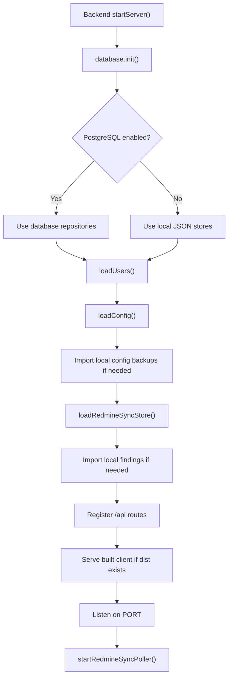

## Authentication And Route Access

The service accepts hub JWTs through `requireAuth`. Legacy local login and
`/api/users` management only operate when `ENABLE_LEGACY_LOCAL_AUTH=true`.

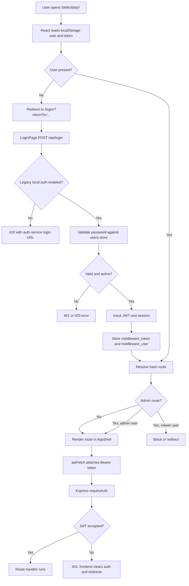

## Dashboard And Live Sync

The dashboard is the default route and acts as the live overview for findings,
Redmine ticket state, mitigation review count, and Sync All progress.

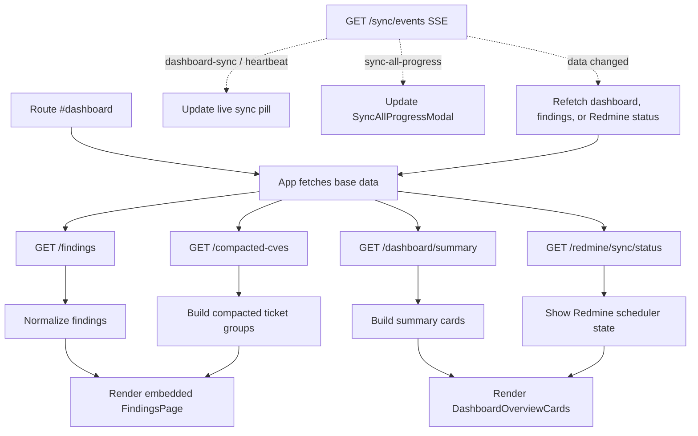

## Findings Browse, Filter, And Detail

Findings can be viewed as a full page or embedded inside the dashboard and
product dashboards. The rendered rows are compacted ticket-sized groups, not
only raw DefectDojo rows.

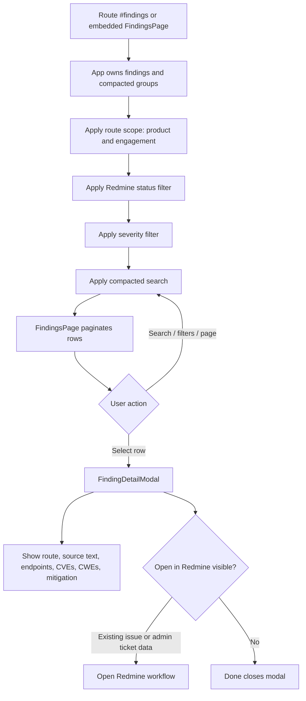

## Single Redmine Issue Workflow

The same action opens an existing issue when possible and creates or updates a
ticket only for admins when no linked issue is available.

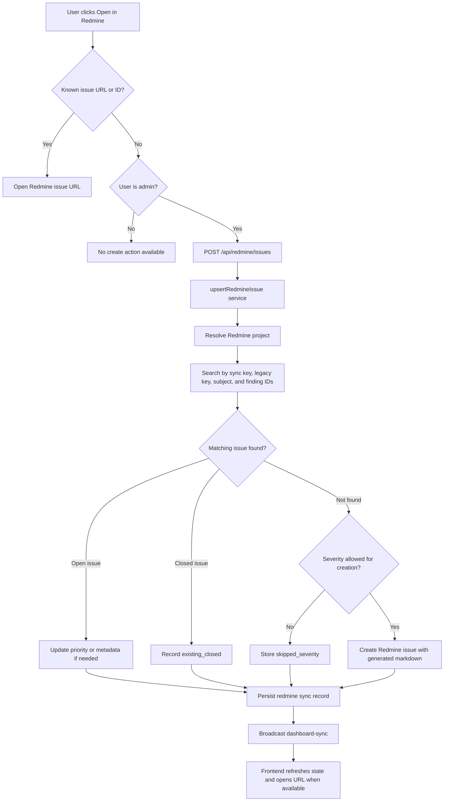

## Product And Company Portal

Product pages are derived from the same compacted finding data. They provide a
company-first drilldown before landing back in a scoped findings table.

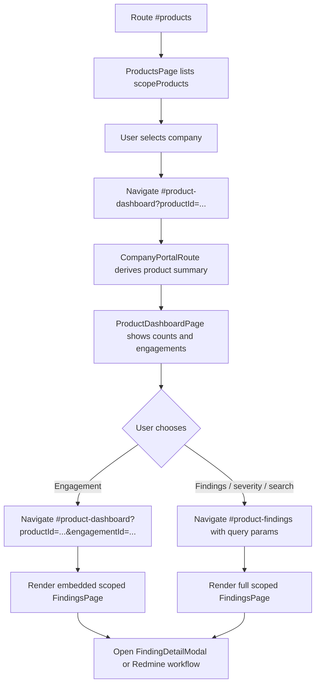

## DefectDojo Pull

`runDefectDojoPull` is used by Sync All and is also exposed through
`POST /api/pull` for admin-only pulls.

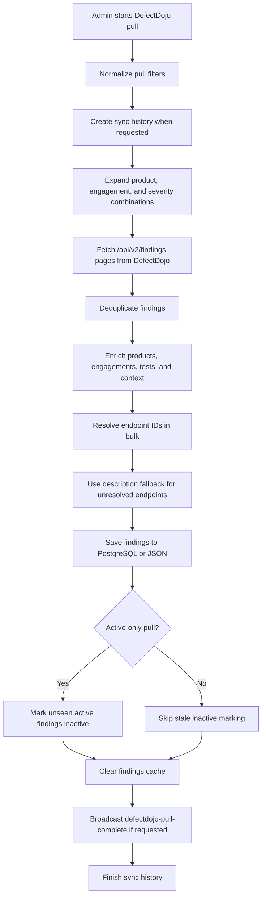

## Sync Findings / Sync All

Sync All is the main operational workflow. It pulls DefectDojo, discovers or
creates Redmine tickets, rechecks mitigations, writes history, and refreshes the
dashboard.

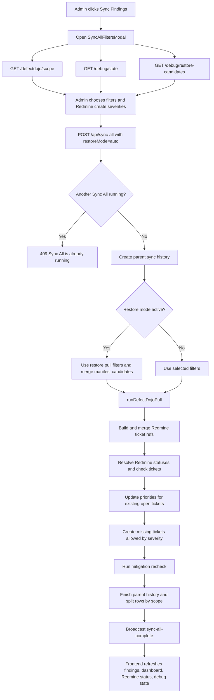

### Sync All Progress Phases

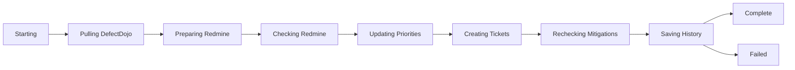

## Redmine Status Sync And Rebuild

The background poller keeps local ticket status current. Admins can also rebuild
the local status cache from current findings through the debug/settings path.

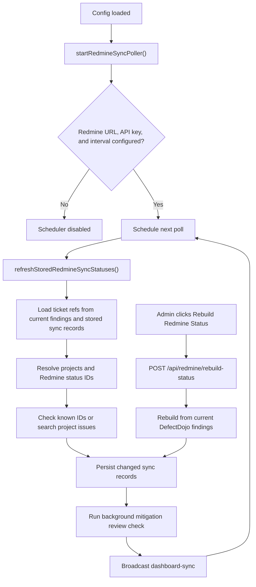

## Mitigation Review

Mitigation review focuses on Redmine tickets in Resolve status. If linked
DefectDojo findings are still active, Sync All can move Redmine back to Feedback.
If linked findings are mitigated, the item is queued for manual admin closure.

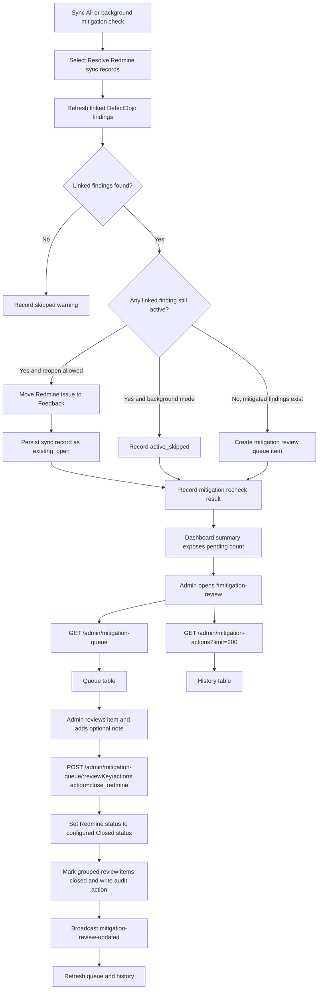

## Sync History

Sync history is database-backed. In JSON fallback mode the API returns an empty
list or a not-found response for item detail.

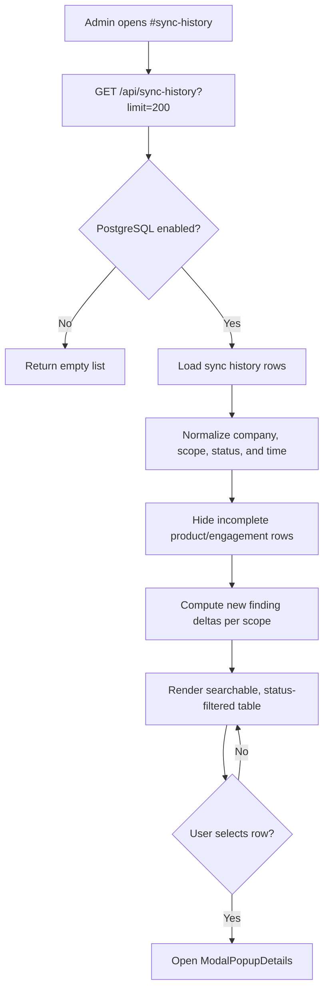

## Settings: Connection And Redmine Status

Connection and Redmine status settings share the same config object and save
footer. Saving always creates a pre-save backup first.

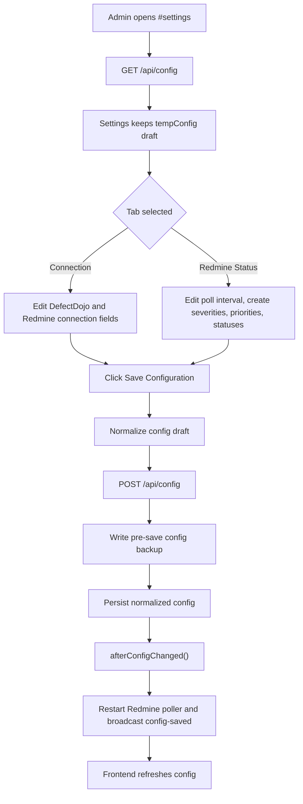

## Settings: Mapped Assets

Mapped assets reconcile discovered hosts with friendly names and domains. The
data is saved as `config.notifyIpMappings`.

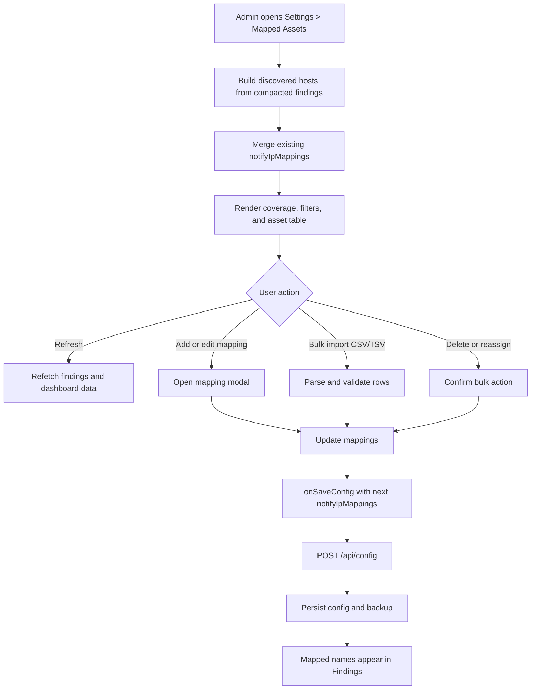

## Settings: Backup, Import, Export, Restore

Backups can be stored in PostgreSQL or local JSON backup files, depending on
the active storage mode.

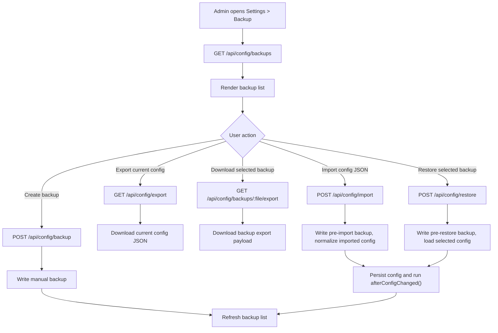

## Settings: Debug And Recovery

Debug tools only change local application state. They do not delete remote
DefectDojo findings or Redmine issues.

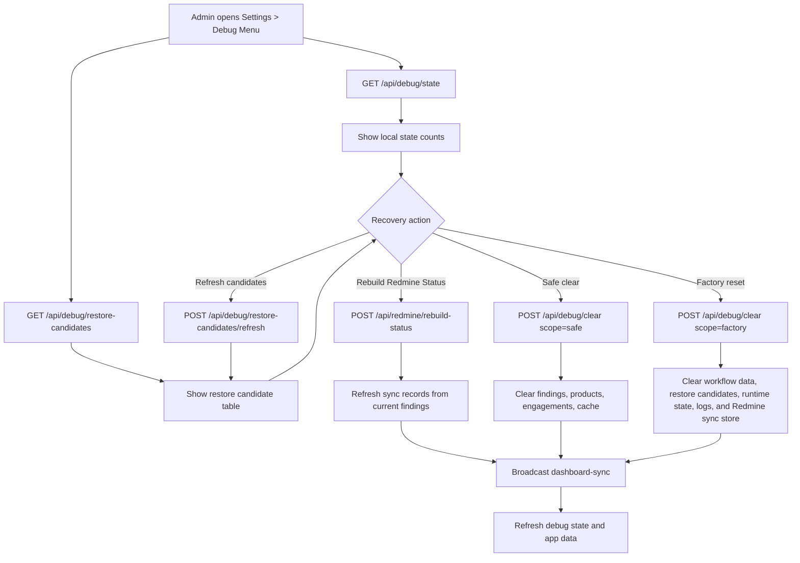

## Log Monitor

The log monitor reads in-memory backend event logs and access logs captured by
the logger middleware.

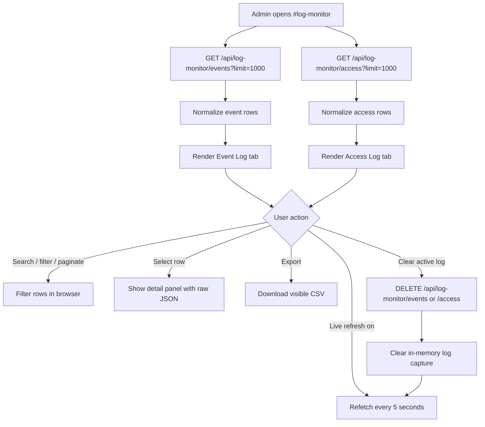

## Legacy Local User Administration

The backend includes local user endpoints for installations that enable legacy
local auth. The current app route for `#users` is legacy and redirects away, but
the API workflow remains available when the environment flag allows it.

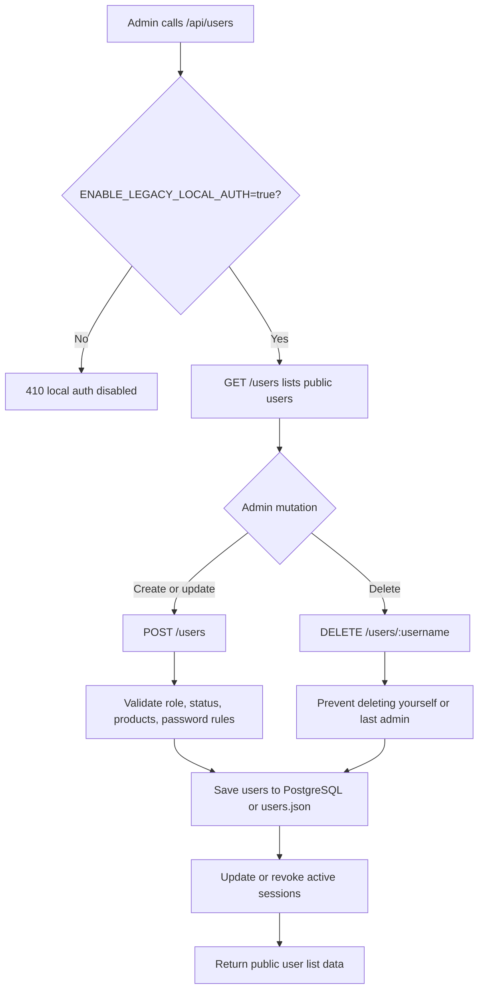
