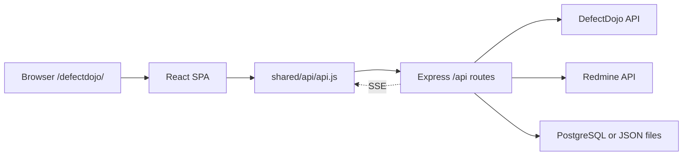

# Vulnerability Service Frontend Architecture

This is the single canonical developer guide for the `vulnerability-service`
frontend. It maps the existing app, explains how to add new work, and includes
the style migration workflow for changing the visual design without losing
features. The service is a Vite React single-page app backed by an Express API
in the same package.

## What This Frontend Does

The frontend is a vulnerability workflow console for DefectDojo findings and
Redmine ticket operations.

Core user features:

- Authenticate with the shared middleware session stored in `localStorage`.
- Show a security dashboard with active/mitigated finding counts, Redmine ticket
  workflow counts, severity distribution, product count, and live sync state.
- Browse compacted findings as ticket-sized work items.
- Search and filter findings by severity, product/company, engagement, Redmine
  status, title, CVE, endpoint, and ticket metadata.
- Inspect a finding detail modal with DefectDojo route context, descriptions,
  impact, endpoints, CVEs/CWEs, mitigation guidance, and generated Redmine text.
- Open an existing Redmine issue or create one for a compacted finding when the
  current user is an admin.
- Browse DefectDojo products and drill into product and engagement scoped
  dashboards.
- Run "Sync Findings" as an admin, including DefectDojo pull filters and a live
  progress dialog.
- Track sync history with status filters, search, pagination, and row details.
- Review resolved/mitigated work in the mitigation review queue, close linked
  Redmine issues, and view review history.
- Configure DefectDojo and Redmine connection settings.
- Configure Redmine status and priority ID mappings.
- Reconcile discovered hosts with recognizable mapped asset names.
- Import/export mapped assets by CSV/TSV/TXT.
- Back up, import, export, download, and restore service configuration.
- Use debug/recovery tools for local state counts, restore candidate previews,
  Redmine status rebuilds, safe cache clear, and factory local workflow reset.

Access model:

- Viewer users can view dashboards/findings and open already-linked Redmine
  issues.
- Admin users can configure integrations, run sync, create/update Redmine
  tickets, manage mapped assets, inspect history, review mitigations, and use
  recovery tooling.

## Technology Stack

- Runtime: React 19 with Vite.
- Language style: plain JavaScript and JSX, no TypeScript.
- Icons: `lucide-react`.
- API calls: browser `fetch` through `src/shared/api/api.js`.
- Styling: CSS modules by feature folder plus shared global theme CSS.
- State: React local state, hooks, derived `useMemo` data, and a centralized
  top-level orchestration component.
- Backend coupling: Express API routes under `backend/routes`.
- Storage: backend supports PostgreSQL when configured, otherwise local JSON
  files.

Useful scripts from `vulnerability-service/package.json`:

```powershell
npm run dev       # Vite dev server
npm run server    # Express backend on port 3001
npm run dev:all   # backend and Vite together
npm run build     # production frontend build
npm run lint      # ESLint
npm test          # node --test ./test/*.test.cjs
```

The Vite base path is `/defectdojo/`. During development, Vite proxies
`/defectdojo/api/*` and `/api/*` to the backend on `http://localhost:3001`.

## High-Level Runtime Flow



The frontend reads the shared auth token from `localStorage.middleware_token`
and sends it as `Authorization: Bearer ...` on API requests. A `401` response
clears local auth state and redirects to `/login/?returnTo=...`.

## Frontend Directory Layout

```text
src/
  main.jsx
  app/
    App.jsx
    AppShell.jsx
    routes.js
  domain/
    findings/
    redmine/
  features/
    auth/
    dashboard/
    findings/
    mitigation-review/
    products/
    settings/
    sync-history/
  shared/
    api/
    lib/
    ui/
  styles/
    index.css
    theme.css
```

Important areas:

- `src/app/App.jsx` owns auth bootstrap, route resolution, cross-feature state,
  data fetching, sync orchestration, Redmine actions, and route rendering.
- `src/app/routes.js` defines hash route IDs and admin requirements.
- `src/app/AppShell.jsx` renders sidebar navigation, role-gated nav items, hub
  return, and logout.
- `src/shared/api/api.js` is the only shared frontend API client. Use it instead
  of calling `fetch` directly, except in login where the token does not exist
  yet.
- `src/shared/ui` contains reusable layout, table, topbar, sidebar, and search
  controls.
- `src/shared/lib/dashboardUtils.js` contains shared formatting, route matching,
  status normalization, and dashboard helpers.
- `src/domain/findings` contains DefectDojo finding normalization, endpoint
  helpers, asset mapping helpers, vulnerability grouping, and compaction logic.
- `src/domain/redmine/redmineTicketFormat.js` builds Redmine labels, subjects,
  priority IDs, ticket markdown, and backend group display normalization.
- `src/features` contains route-level and workflow-level UI modules.

## Routes

Routing is hash based. `resolveAppRoute` splits the hash from the query string,
returns a route ID, and exposes `URLSearchParams` as `route.query`.

| Hash | Route ID | Access | Primary UI |
| --- | --- | --- | --- |
| `#dashboard` or empty | `dashboard` | Viewer/Admin | `DashboardPage` with embedded findings |
| `#findings` | `findings` | Viewer/Admin | full `FindingsPage` |
| `#products` | `products` | Viewer/Admin | `ProductsPage` |
| `#product-dashboard` | `product-dashboard` | Viewer/Admin | `ProductDashboardPage` |
| `#product-findings` | `product-findings` | Viewer/Admin | scoped `FindingsPage` |
| `#sync-history` | `sync-history` | Admin | `SyncHistory` |
| `#mitigation-review` | `mitigation-review` | Admin | `MitigationReview` |
| `#settings` | `settings` | Admin | `Settings` tabs |
| `#management-dashboard` | `management-dashboard` | Admin | redirects to mapped assets |
| `#users` | `users` | Admin | legacy redirect |

When adding a route:

1. Add a route ID and hash in `src/app/routes.js`.
2. Add rendering logic in `src/app/App.jsx`.
3. Add sidebar navigation in `src/app/AppShell.jsx` if it should be globally
   reachable.
4. Enforce admin-only behavior in both frontend routing and backend routes if
   the feature changes protected data.

## API Surface Used By The Frontend

The frontend calls these backend endpoints:

| Endpoint | Access | Frontend owner | Purpose |
| --- | --- | --- | --- |
| `POST /login` | public | `LoginPage` | authenticate and store token/user |
| `POST /logout` | auth | `App.jsx` | best-effort logout |
| `GET /findings` | auth | `App.jsx` | load stored findings |
| `GET /dashboard/summary` | auth | `App.jsx` | dashboard counts |
| `GET /compacted-cves` | auth | `App.jsx` | compacted ticket groups |
| `GET /sync/events` | auth | `api.js`/`App.jsx` | SSE dashboard/sync updates |
| `POST /sync-all` | admin | `App.jsx` | pull DefectDojo and sync Redmine |
| `POST /redmine/issues` | admin | `App.jsx` | create/update/open ticket workflow |
| `GET /redmine/sync/status` | auth | `App.jsx` | poller/scheduler status |
| `POST /redmine/rebuild-status` | admin | `App.jsx` | rebuild local Redmine cache |
| `GET /config` | admin | `App.jsx` | load configuration |
| `POST /config` | admin | `Settings` via `App.jsx` | save configuration |
| `GET /config/backups` | admin | `BackupTab` via `App.jsx` | list backups |
| `POST /config/backup` | admin | `BackupTab` via `App.jsx` | create backup |
| `GET /config/export` | admin | `BackupTab` via `App.jsx` | download current config |
| `GET /config/backups/:file/export` | admin | `BackupTab` via `App.jsx` | download backup |
| `POST /config/import` | admin | `BackupTab` via `App.jsx` | import config JSON |
| `POST /config/restore` | admin | `BackupTab` via `App.jsx` | restore config |
| `GET /sync-history?limit=200` | admin | `SyncHistory` | list sync runs |
| `GET /admin/mitigation-queue` | admin | `MitigationReview` | list review queue |
| `GET /admin/mitigation-actions?limit=200` | admin | `MitigationReview` | review action history |
| `POST /admin/mitigation-queue/:reviewKey/actions` | admin | `MitigationQueue` | close/skip review item |
| `GET /debug/state` | admin | `DebugMenuTab` via `App.jsx` | local state counts |
| `GET /debug/restore-candidates` | admin | `DebugMenuTab` via `App.jsx` | restore candidate preview |
| `POST /debug/restore-candidates/refresh` | admin | `DebugMenuTab` via `App.jsx` | refresh restore manifest |
| `POST /debug/clear` | admin | `DebugMenuTab` via `App.jsx` | safe/factory local clear |

Backend route registration lives in `backend/routes/index.cjs`. Auth routes are
registered first, then `ctx.requireAuth` protects the rest of `/api`.

## Feature Modules

### Authentication

Files:

- `src/features/auth/LoginPage.jsx`
- `src/shared/api/api.js`

Login posts credentials to `${API_BASE}/login`, stores `middleware_token` and
`middleware_user`, then notifies `App.jsx`. Authenticated requests use
`apiFetch` or `authFetch`.

### Dashboard

Files:

- `src/features/dashboard/DashboardPage.jsx`
- `src/features/dashboard/components/DashboardOverviewCards.jsx`
- `src/features/dashboard/components/SummaryCards.jsx`

Dashboard renders overview cards, live sync status, the admin-only Sync Findings
button, and an embedded findings table. Most data shaping happens in `App.jsx`
before props reach the page component.

### Findings

Files:

- `src/features/findings/FindingsPage.jsx`
- `src/features/findings/FindingDetailModal.jsx`
- `src/domain/findings/*`
- `src/domain/redmine/redmineTicketFormat.js`

Findings are displayed as compacted groups rather than raw scanner rows. The
page owns local pagination and filter-panel UI. `App.jsx` owns selected product,
engagement, severity, Redmine status, compacted search, selected finding, and
Redmine action handlers.

### Products

Files:

- `src/features/products/ProductsPage.jsx`
- `src/features/products/ProductDashboardPage.jsx`

Product pages are derived from compacted findings. Product and engagement cards
drill into hash routes with `productId`, `engagementId`, severity, and search
query params.

### Sync History

Files:

- `src/features/sync-history/SyncHistory.jsx`
- `src/features/sync-history/ModalPopupDetails.jsx`

Sync history fetches its own rows, normalizes complete product/engagement runs,
computes "new finding" deltas by scope, and provides status/search filters with
pagination.

### Mitigation Review

Files:

- `src/features/mitigation-review/MitigationReview.jsx`
- `src/features/mitigation-review/MitigationQueue.jsx`
- `src/features/mitigation-review/MitigationHistory.jsx`
- `src/features/mitigation-review/*ModalDetails.jsx`

The review page has queue and history tabs. Queue actions post admin decisions
to the backend and refresh both queue and history. Admin dashboard notifications
are driven by `dashboard/summary` and an in-app toast in `App.jsx`.

### Settings

Files:

- `src/features/settings/Settings.jsx`
- `ConnectionTab`
- `RedmineStatusTab`
- `MappedAssetsTab`
- `BackupTab`
- `DebugMenuTab`

Settings are tabbed through the hash query string, for example
`#settings?tab=mapped-assets`. Connection and Redmine status tabs share a sticky
save footer. Mapped assets saves through the same config object by updating
`notifyIpMappings`.

## Shared UI Conventions

Read `src/shared/ui/README.md` before creating route-level UI.

Current conventions:

- Use `Topbar` for route title, icon, description, metrics, and actions.
- Wrap route bodies in `PageMain`.
- Use `DataTable`, `DataTableSection`, `DataTableRow`, `DataTableCell`, and
  `DataTablePagination` for table/list surfaces.
- Use `SearchOptionsPanel`, `SearchOptionsCommandBar`,
  `SearchOptionsSearch`, and `SearchOptionsFilterGroup` for filter/search
  panels above lists.
- Keep page CSS focused on page-specific layout and cell meanings.
- Use `lucide-react` icons for buttons and navigation.
- Keep technical values such as CVEs, endpoints, IDs, and logs in monospace
  utilities when needed.

Global styling lives in:

- `src/styles/theme.css`
- `src/styles/index.css`
- `src/app/AppShell.css`
- shared component CSS under `src/shared/ui`

## Style Migration Without Feature Loss

Use this workflow when the request is to change the frontend style, for example
from the current dark modern dashboard to a simpler Redmine-like interface,
while keeping every existing function.

Style migration means changing the visual vocabulary only:

- colors, typography, spacing, radius, shadows, borders, density, and motion;
- shared component treatments for shell, topbar, tables, forms, tabs, filters,
  modals, badges, buttons, and empty states;
- page-specific CSS when a route needs final polish.

It does not mean changing:

- route IDs, hash/query behavior, or navigation targets;
- API endpoints, request payloads, or response normalization;
- admin/viewer permission checks;
- table columns, filters, pagination, row actions, modals, and form fields;
- Sync Findings, Redmine ticket actions, mitigation review, backup, mapped asset,
  debug, or auth workflows.

### Functional Parity Contract

Before changing CSS or component layout, create a route checklist from this file
and the current source. For each route, preserve:

- all visible actions and disabled/loading states;
- all filters, search fields, selects, tabs, and pagination controls;
- all table columns and row click/keyboard behavior;
- all modals, confirmation dialogs, toasts, and detail panes;
- all empty, loading, success, warning, and error states;
- all admin-only controls and viewer-visible read-only paths;
- all API refreshes that happen after mutations.

If a visual simplification hides something, it must still be reachable through a
clear standard control. Do not remove a feature because the old visual treatment
looked too busy.

### Redmine-Like Simple Style Target

For a Redmine-like style, aim for a restrained product UI:

- light neutral page background;
- white or very light gray content panels;
- compact fixed-size typography, not fluid display type;
- standard blue links and primary actions;
- gray borders instead of glow, glass, or heavy shadow;
- low border radius, usually 4-6px for controls and panels;
- dense tables with clear headers, hover rows, and readable status badges;
- familiar tabs, forms, fieldsets, and toolbar controls;
- minimal state motion, only hover/focus/loading feedback;
- severity/status color used for meaning, not decoration.

Avoid decorative gradients, glass panels, large hero-like route headers, animated
entrance sequences, oversized cards, hidden controls, and page-specific custom
widgets where a standard button, select, tab, checkbox, or table affordance would
be clearer.

### Restyling Order

Work from shared surfaces outward:

1. Define the target style in `DESIGN.md` or a new design note before editing
   component CSS.
2. Update global tokens in `src/styles/theme.css`. Prefer token changes over
   many page-level overrides.
3. Update global type/layout utilities in `src/styles/index.css` only when the
   whole app needs the new behavior.
4. Restyle app shell and navigation in `src/app/AppShell.css` and
   `src/shared/ui/AppSidebar`.
5. Restyle shared primitives in `src/shared/ui`: `Page`, `Topbar`, `DataTable`,
   `SearchOptions`, buttons, controls, and reusable table states.
6. Sweep feature CSS files only for page-specific layout and semantic cell
   styling.
7. Verify every route from the functional parity checklist.

This order keeps the redesign consistent and avoids rewriting the same visual
decision in every feature folder.

### Redesign Validation

For a style-only migration, validate behavior and visuals:

- build the frontend with `npm run build`;
- open dashboard, findings, products, product dashboard, product findings,
  settings tabs, sync history, and mitigation review;
- check both admin and viewer roles when possible;
- confirm Redmine actions, Sync Findings filters, mapped asset import/export,
  backup flows, debug confirmations, and mitigation review actions remain
  reachable;
- check desktop and mobile widths for table overflow, clipped dropdowns, hidden
  action buttons, unreadable badges, and text overlap;
- confirm body text and muted text meet contrast requirements on the new light
  surfaces.

## Data And State Architecture

`App.jsx` is the orchestration center. It currently owns:

- authenticated user state;
- current hash route;
- raw and normalized findings;
- dashboard summary and Redmine summary state;
- compacted CVE/ticket groups;
- product and engagement scope selections;
- active severity and Redmine status filters;
- config and config backup state;
- debug and restore candidate state;
- selected finding modal state;
- Redmine ticket creation/opening state;
- Sync Findings modal, filters, progress, and summary state;
- dashboard SSE connection state;
- mitigation review toast state.

Derived data is mostly computed with `useMemo` inside `App.jsx` and then passed
down as props. New code should prefer feature-local state for UI-only concerns
such as pagination, open panels, drafts, and selected rows. Cross-feature state
belongs in `App.jsx` until the app introduces a formal store.

The `zustand` package is installed but not currently used by this frontend.
Avoid introducing it casually; doing so would create two state-management
patterns.

## Compaction And Ticket Model

The app works in two layers:

- Raw DefectDojo findings are loaded from the backend and normalized for missing
  endpoint details and route context.
- Compacted groups represent ticket-sized units grouped by software family,
  CVE/CWE relationships, endpoint evidence, source text, and DefectDojo route.

Important helpers:

- `findingUtils.js`: config defaults, pull filter normalization, date parsing,
  DefectDojo route extraction, endpoint fallback normalization, version parsing.
- `vulnerabilityUtils.js`: CVE/software-family extraction and grouping helpers.
- `endpointUtils.js`: endpoint label, host, port, and parsing helpers.
- `compactionUtils.js`: stable compacted sync keys, source grouping, finding
  count, endpoint details, and compaction fingerprints.
- `assetMappingUtils.js`: map discovered endpoints/hosts to configured asset
  labels.
- `redmineTicketFormat.js`: generated Redmine subject/markdown, sync labels,
  priority lookup, and backend compacted group normalization.

When changing grouping, ticket identity, or Redmine body generation, update both
frontend and backend domain helpers if there is a duplicated implementation.
Then run the relevant `test/*.test.cjs` files.

## Adding A New Frontend Feature

Use this path for most new pages or workflows:

1. Identify whether the feature is viewer-visible or admin-only.
2. Add a feature folder under `src/features/<feature-name>`.
3. Put route-level UI in `<FeatureName>Page.jsx` or a similar explicit name.
4. Put feature-specific CSS beside the component.
5. Reuse `Topbar`, `PageMain`, `DataTable`, and `SearchOptions` before adding
   new structural UI.
6. Keep feature-local UI state in the feature component.
7. Add cross-feature state and API orchestration to `App.jsx` only when multiple
   routes need the data or the workflow touches existing sync/config state.
8. Add domain helpers under `src/domain/<domain>` when the logic is reusable,
   security-sensitive, or has testable normalization rules.
9. Add API calls through `apiFetch` or `authFetch`.
10. Add backend routes in `backend/routes/*` and enforce `ctx.requireAdmin` for
    protected mutations.
11. Add route IDs in `src/app/routes.js` and rendering in `App.jsx`.
12. Add sidebar navigation in `AppShell.jsx` only for top-level destinations.
13. Add focused tests for shared helpers or backend domain behavior.
14. Run `npm run build`, `npm run lint`, and `npm test` as appropriate.

## Adding A Settings Tab

1. Create `src/features/settings/<TabName>/<TabName>.jsx` and CSS.
2. Import it into `src/features/settings/Settings.jsx`.
3. Add a tab button with a stable query value, for example
   `#settings?tab=my-tab`.
4. Decide whether it uses the shared config save footer or saves independently.
5. If it changes `config`, update through `onSaveConfig`.
6. If it needs fresh backend data, fetch in `App.jsx` when the data is shared,
   or inside the tab if the data is only local to that tab.

## Adding An API-Backed Workflow

1. Add or reuse a backend route module under `backend/routes`.
2. Register it in `backend/routes/index.cjs`.
3. Require auth/admin at the route level.
4. Return JSON with stable field names; avoid frontend-only response shapes.
5. Add a small frontend function in the owning component or a shared API helper
   if more than one feature will call it.
6. Normalize backend data at the boundary before rendering.
7. Add loading, empty, success, and error states.
8. Refresh affected dashboard or route data after mutations.
9. Broadcast dashboard sync events from the backend if other views should update
   in real time.

## Validation Checklist

For UI-only changes:

```powershell
cd vulnerability-service
npm run build
npm run lint
```

For data normalization, compaction, history, auth fallback, restore, or mapped
asset changes:

```powershell
cd vulnerability-service
npm test
```

For full local operation:

```powershell
cd vulnerability-service
npm run dev:all
```

Then open the Vite URL and verify:

- login redirect still works;
- dashboard loads without console errors;
- viewer users do not see admin routes/actions;
- admin users can open relevant modals;
- table pagination and filters do not reset unexpectedly;
- a `401` redirects to login;
- the `/defectdojo/` base path still works after production build.

## Current Architecture Notes

- `App.jsx` is large and central. When possible, add new feature-local logic in
  feature components and only lift state to `App.jsx` when it is genuinely
  shared.
- Auth and admin checks are duplicated intentionally: frontend checks shape the
  UI, backend checks protect data.
- The frontend uses hash routes, so query-string state for app pages belongs
  after the hash, such as `#product-findings?productId=123`.
- The app has duplicated frontend/backend domain logic around compaction,
  Redmine status, and sync keys. Keep them aligned.
- Existing tests focus on backend/domain utilities rather than rendered React
  pages.
- Some debug/mockup files may be active development artifacts. Check `git
  status` before touching related files.
